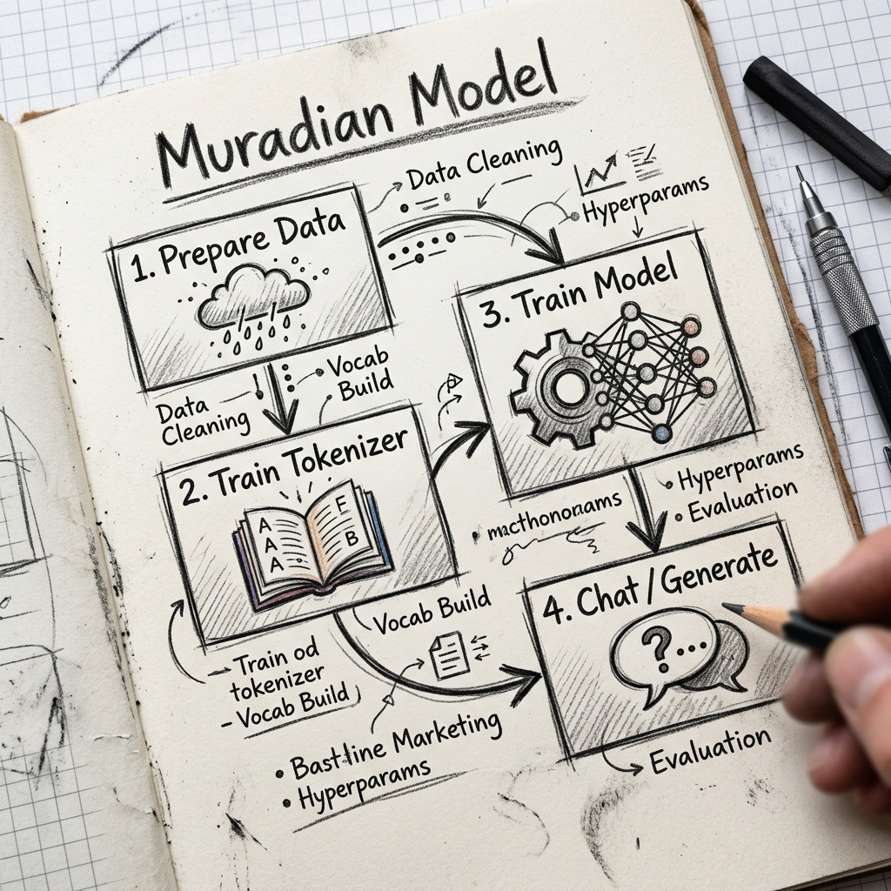
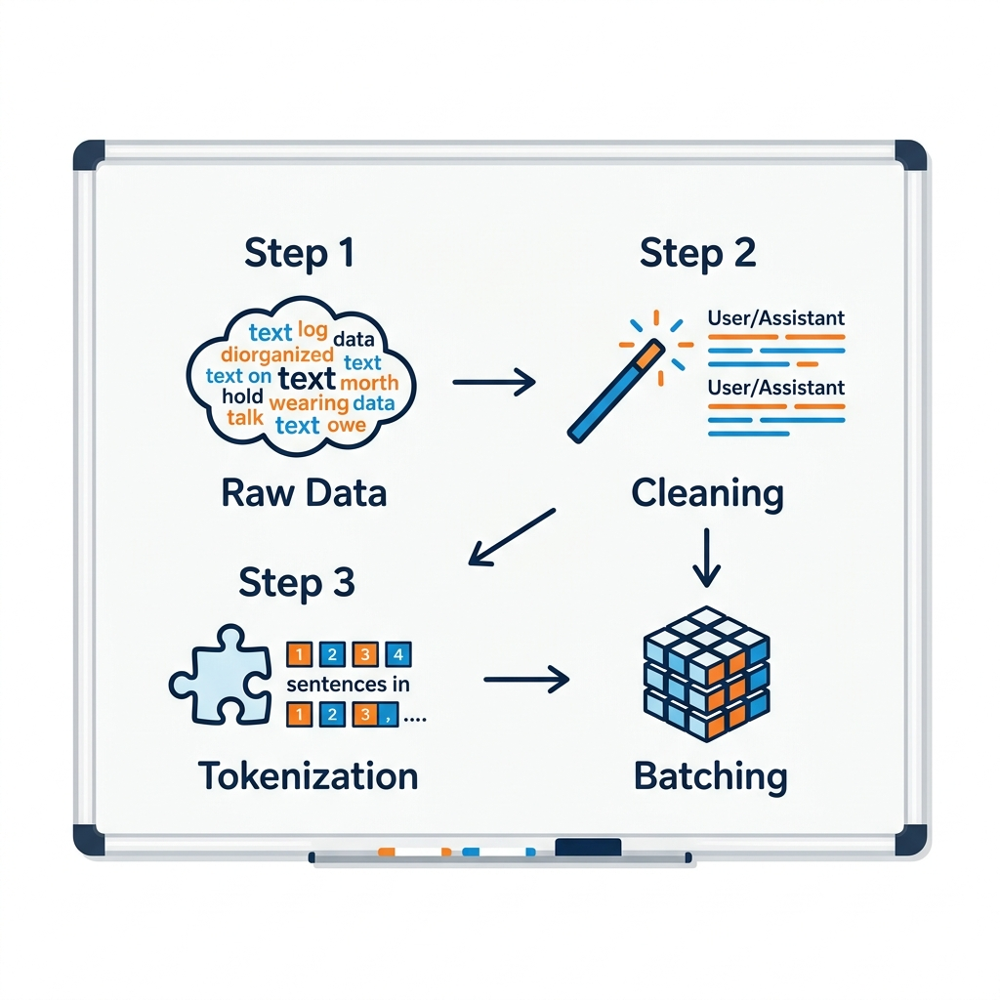
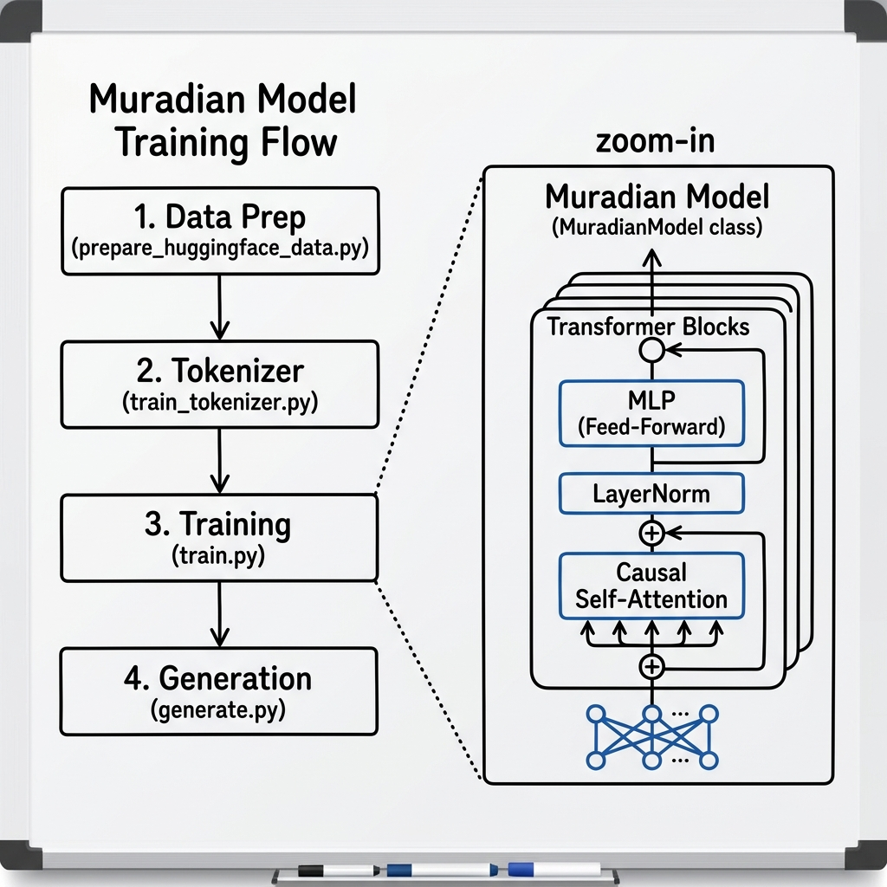

# Muradian Model Beta v0.1

[](https://github.com/mozaddedalfeshani/muradian_model_beta_v0.1)



এটি একটি কাস্টম **Decoder-Only Transformer** ল্যাঙ্গুয়েজ মডেল যা একদম স্ক্র্যাচ (Scratch) থেকে পাইটর্চ (PyTorch) ব্যবহার করে তৈরি করা হয়েছে। এই প্রজেক্টের মূল উদ্দেশ্য হলো একটি ছোট কিন্তু শক্তিশালী মডেল তৈরি করা যা নির্দিষ্ট তথ্যের (যেমন: বাংলা চ্যাট ডাটা) ওপর ভিত্তি করে টেক্সট জেনারেট করতে পারে।

## 🚀 এটি কিভাবে কাজ করে? (How it works)

এই মডেলটি একটি **Generative Pre-trained Transformer (GPT)** আর্কিটেকচার অনুসরণ করে। এটি ইনপুট হিসেবে কিছু টেক্সট নেয় এবং তার পরের সম্ভাব্য শব্দটি (Token) কি হতে পারে তা প্রেডিক্ট করে।

### কাজের ধাপসমূহ:
1. **ডাটা প্রিপারেশন:** `prepare_huggingface_data.py` ব্যবহার করে Hugging Face থেকে বাংলা আলপাকা dataset সংগ্রহ এবং প্রসেস করা হয়।
2. **টোকেনাইজেশন:** টেক্সটগুলোকে BPE (Byte Pair Encoding) ব্যবহার করে ১৬,৩৮৪ ভোকাব সাইজের ছোট ছোট টোকেনে ভাগ করা হয়। এর জন্য `train_tokenizer.py` ব্যবহার করা হয়।
3. **ট্রেনিং:** `train.py` ব্যবহার করে মডেলটিকে এই ডাটার ওপর ট্রেন করা হয়। এখানে এখন একটি ভ্যালিডেশন লুপ এবং লাইভ স্যাম্পল জেনারেশন অন্তর্ভুক্ত আছে।
4. **জেনারেশন ও টেস্টিং:** ট্রেনিং শেষ হলে `generate.py` বা `test_questions.py` দিয়ে আমরা মডেলের আউটপুট পরীক্ষা করতে পারি।

### 📂 ডাটা প্রসেসিং পাইপলাইন (Data Processing Pipeline)

একটি নন-কোডার ফ্রেন্ডলি ভিউ থেকে আমাদের ডাটা যেভাবে প্রসেস হয়:



### 📊 আর্কিটেকচার ডায়াগ্রাম (Architecture Diagram)



## 🛠 আমরা কি কি মেথড ফলো করেছি? (Methodology)

এই মডেলটি তৈরির ক্ষেত্রে আধুনিক ডিপ লার্নিংয়ের বেশ কিছু উন্নত পদ্ধতি ব্যবহার করা হয়েছে:

*   **Transformer Architecture:** ১২টি লেয়ার এবং ১২টি অ্যাটেনশন হেড বিশিষ্ট একটি ট্রান্সফর্মার ব্লক ব্যবহার করা হয়েছে।
*   **BPE Tokenization:** HuggingFace `tokenizers` লাইব্রেরি ব্যবহার করে ১৬,৩৮৪ ভোকাব সাইজের একটি কাস্টম টোকেনাইজার তৈরি করা হয়েছে।
*   **Flash Attention:** প্রসেসিং দ্রুত করার জন্য PyTorch-এর স্কেলড ডট প্রোডাক্ট অ্যাটেনশন ব্যবহার করা হয়েছে।
*   **Training & Evaluation:**
    *   **Validation Loop:** ট্রেনিংয়ের সময় মডেলের পারফরম্যান্স ট্র্যাক করার জন্য ভ্যালিডেশন লস চেক করা হয়।
    *   **AdamW Optimizer:** মডেলের ওয়েট আপডেট করার জন্য ব্যবহৃত হয়েছে।
    *   **Cosine LR Decay:** ট্রেনিংয়ের সময় লার্নিং রেট ধীরে ধীরে কমানোর জন্য এই শিডিউলার ব্যবহার করা হয়েছে।
*   **Advanced Features:**
    *   **Weight Tying:** ইনপুট এমবেডিং এবং আউটপুট লেয়ারের ওয়েট শেয়ার করা হয়েছে।
    *   **Clean Dataset Pipeline:** ডাটা ক্লিনিং এবং প্রপার User/Assistant ফরম্যাটিং নিশ্চিত করা হয়েছে।

## 📊 মডেল স্পেসিফিকেশন (Technical Specs)

- **প্যারামিটার সংখ্যা:** ২৭.৫ মিলিয়ন (~27.5M)
- **লেয়ার (Layers):** ১২টি
- **হিডেন সাইজ (Hidden Size):** ৩৮৪
- **অ্যাটেনশন হেড (Heads):** ১২টি
- **কনটেক্সট লেংথ (Context Length):** ৫১২ টোকেন
- **ভোকাবুলারি সাইজ:** ১৬,৩৮৪

## 📂 প্রজেক্ট স্ট্রাকচার

- `model.py`: ট্রান্সফর্মার আর্কিটেকচারের মূল কোড।
- `config.py`: হাইপার-প্যারামিটার এবং কনফিগারেশন।
- `tokenizer.py`: BPE টোকেনাইজার হ্যান্ডলার।
- `dataset.py`: ডাটা লোড করার পাইপলাইন।
- `train.py`: ট্রেনিং স্ক্রিপ্ট (Eval লুপ সহ)।
- `generate.py`: টেক্সট জেনারেশন স্ক্রিপ্ট।
- `train_tokenizer.py`: টোকেনাইজার ট্রেনিং টুল।
- `prepare_huggingface_data.py`: বাংলা চ্যাট ডাটা প্রসেসিং টুল।
- `test_questions.py`: মডেল টেস্ট করার জন্য নির্দিষ্ট কিছু প্রশ্নের স্ক্রিপ্ট।
- `export_onnx.py`: মডেলটিকে ONNX ফরম্যাটে এক্সপোর্ট করার টুল।

## ⚙️ সেটাপ এবং ব্যবহার (Setup & Usage)

### ১. পরিবেশ তৈরি করা
```bash
python3 -m venv .venv
source .venv/bin/activate
pip install -r requirements.txt
```

### ২. ডাটা প্রস্তুত করা
```bash
python prepare_huggingface_data.py
python train_tokenizer.py
```

### ৩. ট্রেনিং শুরু করা
```bash
python train.py
```

### ৪. মডেল ব্যবহার করা
```bash
python generate.py --prompt "User: কেমন আছ?\nAssistant:" --tokens 100
# অথবা
python test_questions.py
```

---
**Repository:** [https://github.com/mozaddedalfeshani/muradian_model_beta_v0.1](https://github.com/mozaddedalfeshani/muradian_model_beta_v0.1)
